<div align="center">


<br>

<a href="mailto:moorthi18krishna@gmail.com"></a>
<a href="https://www.linkedin.com/in/krishnamoorthi-r-developer/"></a>
<a href="https://github.com/krizz18bugger"></a>
<a href="https://portfolio-phi-rosy-17.vercel.app/"></a>


</div>

### 🧑‍💻 About Me

```yaml
name: Krishnamoorthi R
role: MERN Stack Developer
education: "MCA @ The Gandhigram Rural Institute – DTBU (CGPA: 8.9)"
internship: "MERN Stack Developer Intern at ASM Academy, building production-ready dashboards"
focus: ["React.js", "Node.js", "Express.js", "MongoDB", "REST APIs"]
mindset: "Clean code. Scalable systems. User-first design."
fun_fact: "I debug with console.log AND pride 😄"
```

<br>

### 🧰 Tech Arsenal

<div align="center">

</div>

<br>

<div align="center">


</div>

---

### 💼 Internship Experience

<table width="100%">
<tr><td>

**🏢 MERN Stack Developer Intern** — *ASM Academy, Nilakottai, Dindigul*
🗓️ Feb 2026 – Apr 2026

- 🏗️ Built a full-stack **Venue Booking Web Application** using React.js, Node.js, Express.js & MongoDB
- 👤 Engineered the **Hall Owner Module** — listings, booking approvals/rejections, and revenue analytics
- 🔗 Designed and integrated REST APIs with MongoDB, and built reusable, responsive React components
- 🤝 Collaborated cross-functionally to plan features, resolve bugs & ship a production-ready dashboard

</td></tr>
</table>

---

### 🚀 Featured Projects

<table>
<tr>
<td width="50%" valign="top">

#### 🏨 Venue Booking Web Application
`React.js` `Node.js` `Express.js` `MongoDB`

Full-stack MERN app streamlining booking requests & approval workflows, with a Hall Owner dashboard for revenue analytics and booking status tracking — fully responsive across devices.

</td>
<td width="50%" valign="top">

#### 🎬 Anime Watchlist Tracker
`React (Vite)` `Node.js` `MongoDB Atlas` `Mongoose`

Manage anime & TV show watchlists with complete CRUD functionality. RESTful APIs modeled with Mongoose, styled with Tailwind CSS, deployed with environment-based config.

</td>
</tr>
<tr>
<td width="50%" valign="top">

#### 🌐 Developer Portfolio
`React` `Framer Motion` `CSS`

Responsive portfolio with interactive animations & a dark mode toggle. Optimized for performance through reusable, accessible components.

</td>
<td width="50%" valign="top">

#### 🤲 Webpages for Seva NGO
`HTML5` `CSS3` `JavaScript`

Responsive, accessible webpages that improved navigation & UX, with interactive UI features that boosted engagement.

</td>
</tr>
</table>

---

### 📊 GitHub Stats

<div align="center">


</div>

<div align="center">

</div>

<div align="center">

</div>

---

### 🐍 Contribution Snake

<div align="center">

</div>

> 

---

### 🎓 Education

| Degree | Institution | CGPA | Duration |
|---|---|---|---|
| 🎓 MCA | The Gandhigram Rural Institute – DTBU | **8.9** | 2024 – 2026 |
| 📐 B.Sc. Mathematics | The Gandhigram Rural Institute – DTBU | **8.6** | 2021 – 2024 |

---

### 📜 Certifications

🏅 Responsive Web Design — freeCodeCamp&nbsp;&nbsp;|&nbsp;&nbsp;🏅 JavaScript Algorithms & Data Structures — freeCodeCamp&nbsp;&nbsp;|&nbsp;&nbsp;🏅 Full Stack Web Development Training

---

<div align="center">

### 💬 "Clean code, scalable solutions, user-friendly experiences."


</div>
